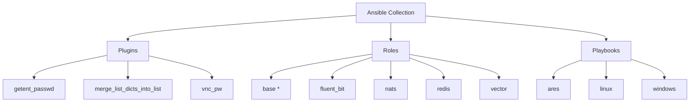

# Ansible Collection: Dreadnode Nimbus Range

[](https://github.com/dreadnode/ansible-collection-nimbus_range/actions/workflows/pre-commit.yaml)
[](https://github.com/dreadnode/ansible-collection-nimbus_range/actions/workflows/renovate.yaml)

This Ansible collection provides agent and logging setup functionality for
cloud-based ephemeral environments, focusing on operational telemetry
collection, session management, and centralized log forwarding.

## Architecture Diagram



## Requirements

- Ansible 2.18.4 or higher

## Installation

Install the latest version of the Nimbus Range collection:

```bash
ansible-galaxy collection install git+https://github.com/dreadnode/ansible-collection-nimbus_range.git,main
```

## Roles

External-collection roles referenced by these playbooks:

- Attack tooling (`acl_tools`, `coercion_tools`, `cracking_tools`,
  `credential_access_tools`, `lateral_movement_tools`, `mythic`,
  `privesc_tools`, `recon_tools`, `sliver`) — sourced from
  [`l50.arsenal`](https://github.com/l50/ansible-collection-arsenal).
- Cloud + host monitoring (`aws_ssm_agent`, `aws_cloudwatch_agent`,
  `sysmon`, `alloy`) — sourced from
  [`l50.bulwark`](https://github.com/l50/ansible-collection-bulwark).

See [`requirements.yml`](requirements.yml) for the exact collection sources.

### Fluent Bit Setup

Installs and configures **Fluent Bit** for log collection, enrichment, and
forwarding to OpenSearch.

- Role docs: [`roles/fluent_bit/README.md`](roles/fluent_bit/README.md)

- Collects Linux system logs and Windows Event logs.
- Captures AWS SSM session activity logs.
- Enriches logs with environment metadata and deployment context.
- Forwards logs securely to an OpenSearch cluster.

### Base Setup

Installs the base dependencies and workspace layout required for **Ares AI agents**.

- Role docs: [`roles/base/README.md`](roles/base/README.md)

- Bootstraps Python toolchains, pip packages, and system utilities.
- Optionally installs uv, Rust, and pipx for downstream tooling.

## Usage

### Linux Example

```yaml
---
- name: Provision Linux Attack Range Box
  hosts: all
  gather_facts: true
  vars:
    fluent_bit_env: dev
    fluent_bit_deployment_name: default
    fluent_bit_opensearch_custom_domain: contoso.local
    fluent_bit_opensearch_username: admin
    fluent_bit_opensearch_password: password
    fluent_bit_version: "4.0.1"

  roles:
    # Nimbus Range roles for Ansible system configuration and monitoring
    - role: l50.bulwark.aws_ssm_agent
    - role: l50.bulwark.aws_cloudwatch_agent
    - role: dreadnode.nimbus_range.fluent_bit
```

### Windows Example

```yaml
---
- name: Provision Windows Attack Range Target
  hosts: all
  vars:
    fluent_bit_env: dev
    fluent_bit_deployment_name: default
    fluent_bit_opensearch_custom_domain: contoso.local
    fluent_bit_opensearch_username: admin
    fluent_bit_opensearch_password: password
    fluent_bit_version: "4.0.1"

  roles:
    # Nimbus Range roles for Ansible system configuration and monitoring
    - role: l50.bulwark.aws_ssm_agent
    - role: l50.bulwark.aws_cloudwatch_agent
    - role: dreadnode.nimbus_range.fluent_bit
```

## Development

This collection lives inside the [ares](https://github.com/dreadnode/ares)
repository and is consumed directly from this subdirectory - it is not
published to Ansible Galaxy. See [docs/development.md](docs/development.md)
for layout, pre-commit hooks (including the architecture-diagram regen),
molecule usage, and CI details.

## Support

- Repository: [dreadnode/ansible-collection-nimbus_range](https://github.com/dreadnode/ansible-collection-nimbus_range)
- Issue Tracker: [GitHub Issues](https://github.com/dreadnode/ansible-collection-nimbus_range/issues)
